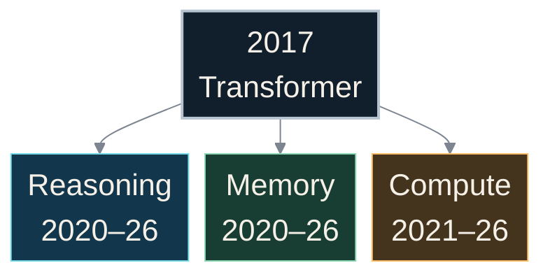
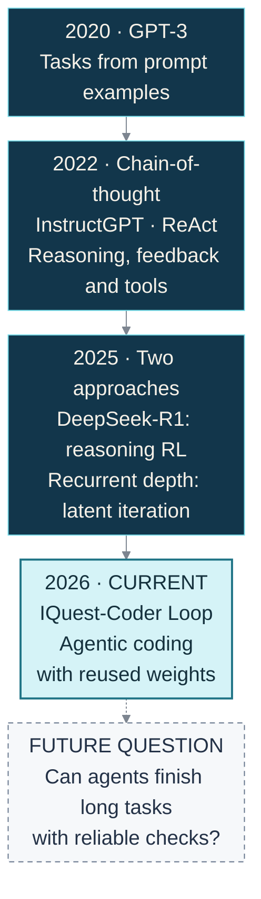
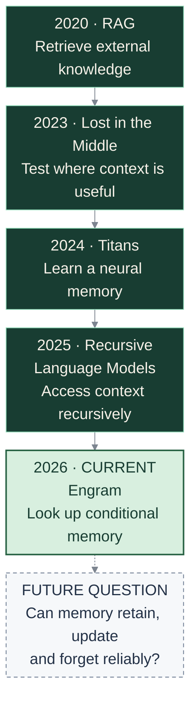
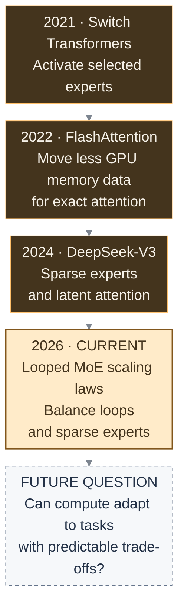

# Awesome LLM Papers 

> A curated list of seminal and breakthrough papers in Large Language Models.

**Read what matters. Skip the noise.** 🎯

Find the idea that changed the field, understand what the evidence supports, and follow it to the next useful paper. Selection favors distinct contributions and lasting reader value, across any lab, category or year.

**Your starting point:** [Understand the foundations](categories/hall-of-fame.md) · [Follow a reading route](#-this-weeks-essential-reads) · [Find a research area](#%EF%B8%8F-browse-by-category)

## Contents

- [🔥 Today's Pick](#-todays-pick)
- [🔥 Trending Topics](#-trending-topics)
- [📆 This Week's Essential Reads](#-this-weeks-essential-reads)
- [📚 Must-Read Papers (Hall of Fame)](#-must-read-papers-hall-of-fame)
- [🗂️ Browse by Category](#%EF%B8%8F-browse-by-category)
- [📈 Research Trends Dashboard](#-research-trends-dashboard)
- [🤝 Contributing](#-contributing)

## 🔥 Today's Pick

### 📍 [Lost in the Middle: How Language Models Use Long Contexts](https://arxiv.org/abs/2307.03172)

*Selected 10 October 2026 · First public paper: July 2023 · TACL 2024*

<table>
<tr>
<td width="70%" valign="top">

**Authors:** Nelson F. Liu et al.

**The idea to take away:** accepting a long input and using it well are different abilities.

The authors move relevant information through long inputs while keeping the task comparable. Many tested models answer better when that information is near the beginning or end, and worse when it sits in the middle.

**Why read it:** this gives you a practical evaluation design for long-context models and retrieval systems—not just a larger context-window number.

</td>
<td width="30%" valign="top">

**Read with these questions:**

- Where is the useful evidence?
- Does moving it change the answer?
- Which model and task were tested?

**Resources:** [Paper](https://arxiv.org/abs/2307.03172) · [TACL version](https://aclanthology.org/2024.tacl-1.9/) · [Related reading](categories/rag.md#-long-context)

</td>
</tr>
</table>

> **Keep the boundary in view:** these are experiments with particular 2023 models, multi-document QA and key-value retrieval. Retest the idea on your own model and task.

---

## 🔥 Trending Topics

*Editorial reading themes selected 10 October 2026. These are suggested directions through the collection, not measured popularity rankings.*

| Research question | Start reading |
| :-- | :-- |
| ✅ **How do we know a solution is right?** | [Verifiers](https://arxiv.org/abs/2110.14168) → [Process supervision](https://arxiv.org/abs/2305.20050) |
| 🌀 **Can a model think without writing every step?** | [Coconut](https://arxiv.org/abs/2412.06769) · [Recurrent depth](https://arxiv.org/abs/2502.05171) |
| 🧠 **What belongs inside the context window?** | [Long context](categories/rag.md#-long-context) · [Memory systems](categories/rag.md#-memory-systems) |
| 🧩 **Where should computation and memory go?** | [MoE](categories/architectures.md#-mixture-of-experts) · [Recent architectures](categories/architectures.md#-recent-breakthroughs) |
| 🛡️ **When does alignment leave a weakness behind?** | [Evaluation](categories/analysis.md#-evaluation) · [Safety](categories/safety.md) |

---

## 📆 This Week's Essential Reads

<b>Five readings: from visible reasoning to latent computation</b> · Selected 10 October 2026

Use the weekday labels as a suggested reading sequence at your own pace.

| Reading | Paper and question |
| :-- | :-- |
| **Monday** Elicit | [Zero-Shot Reasoners](https://arxiv.org/abs/2205.11916) What changes when we request reasoning without demonstrations? |
| **Tuesday** Aggregate | [Self-Consistency](https://arxiv.org/abs/2203.11171) Can several imperfect paths yield a better answer? |
| **Wednesday** Verify | [Training Verifiers](https://arxiv.org/abs/2110.14168) How does selecting differ from generating? |
| **Thursday** Compress | [Coconut](https://arxiv.org/abs/2412.06769) What survives when intermediate states are continuous? |
| **Friday** Iterate | [Recurrent Depth](https://arxiv.org/abs/2502.05171) What does extra hidden computation buy? |

**Before the route:** [Few-shot CoT summary](summaries/Chain-of-Thought%20Prompting.md). **After it:** [Verification and search](categories/reasoning.md#-verification--search) · [Test-time compute](categories/reasoning.md#%EF%B8%8F-test-time-compute).

*Selections are dated and refreshed when there is something worth recommending; there is no daily or weekly publishing schedule.*

---

## [📚 Must-Read Papers (Hall of Fame)](categories/hall-of-fame.md)

> 🏛️ **Established works with lasting influence.** Promising new breakthroughs belong in the main categories while their influence develops.

| Paper and resources | Why read it |
| :-- | :-- |
| 🏗️ **Attention Is All You Need** · 2017 [Paper](https://arxiv.org/abs/1706.03762) · [Summary](summaries/Attention%20Is%20All%20You%20Need%20.md) | Understand self-attention, parallel training and the Transformer’s encoder–decoder design. |
| 🚀 **Language Models are Few-Shot Learners** · 2020 [Paper](https://arxiv.org/abs/2005.14165) · [Summary](summaries/GPT-3%20Language%20Models%20are%20Few-Shot%20Learners.md) | Separate pretraining scale from adapting a task through prompt examples. |
| 🧮 **Chain-of-Thought Prompting** · 2022 [Paper](https://arxiv.org/abs/2201.11903) · [Summary](summaries/Chain-of-Thought%20Prompting.md) | See what worked demonstrations change—and what explanations cannot certify. |
| 🎯 **InstructGPT** · 2022 [Paper](https://arxiv.org/abs/2203.02155) · [Summary](summaries/RLHF%20Training%20with%20Human%20Feedback.md) | Follow demonstrations → reward modeling → policy optimization. |
| 🛡️ **Constitutional AI** · 2022 [Paper](https://arxiv.org/abs/2212.08073) · [Summary](summaries/Constitutional%20AI%20Harmlessness%20from%20AI%20Feedback.md) | Understand AI harmlessness feedback alongside human helpfulness labels. |

[**View all 46 Hall of Fame works →**](categories/hall-of-fame.md)

---

## 🗂️ Browse by Category

**Looking for something specific?** Choose the question closest to your work.

**📋 [All Papers (Chronological)](categories/all-papers.md)** · **149 unique works · 2000–2026**

<table>
<tr>
<td width="50%" valign="top">

### [🏗️ Model Architectures](categories/architectures.md)

How should a language model be built?

Transformers · recurrent depth · state spaces · MoE 
**37 works**

</td>
<td width="50%" valign="top">

### [🧮 Reasoning & Agents](categories/reasoning.md)

How should it reason, search and act?

Prompting · verification · latent reasoning · tools 
**23 works**

</td>
</tr>
<tr>
<td width="50%" valign="top">

### [⚡ Efficiency & Scaling](categories/efficiency.md)

Where can compute and memory be saved?

Quantization · pruning · attention · training systems 
**16 works**

</td>
<td width="50%" valign="top">

### [🎯 Training & Alignment](categories/training.md)

What signals should shape its behavior?

Pretraining · preferences · adaptation · self-training 
**33 works**

</td>
</tr>
<tr>
<td width="50%" valign="top">

### [🎨 Multimodal Models](categories/multimodal.md)

How do language and visual representations meet?

Vision–language · image generation · video 
**18 works**

</td>
<td width="50%" valign="top">

### [📚 RAG & Knowledge](categories/rag.md)

How should it access information beyond its weights?

Retrieval · long context · memory · recursive access 
**17 works**

</td>
</tr>
<tr>
<td width="50%" valign="top">

### [🛡️ Safety & Security](categories/safety.md)

Which failure modes survive our defenses?

Attacks · engineered backdoors · safety evaluation 
**7 works**

</td>
<td width="50%" valign="top">

### [🔬 Analysis & Theory](categories/analysis.md)

What does the evidence actually tell us?

Circuits · scaling · evaluation · critical analysis 
**22 works**

</td>
</tr>
</table>

*A useful cross-list appears in each relevant category but counts once in the complete index. Counts include curated papers, reports and author research resources.*

---

## 📈 Research Trends Dashboard

**Follow the ideas that changed what language models can do.** Start with the [Transformer (2017)](https://arxiv.org/abs/1706.03762), then follow a research thread below.

*Selected milestones, checked 10 October 2026. Each branch progresses independently. Dates come from the linked primary records; spacing does not measure elapsed time. Arrows connect related research themes, rather than showing a direct causal chain.*

```mermaid
%%{init: {"theme":"base","themeVariables":{"fontFamily":"sans-serif","fontSize":"22px","lineColor":"#7d8590"},"flowchart":{"curve":"basis","nodeSpacing":12,"rankSpacing":26,"padding":6}}}%%
flowchart TD
    accTitle: Three research threads from the Transformer
    accDescr: The 2017 Transformer branches into reasoning and agents, with selected milestones from 2020 to 2026; knowledge and memory, from 2020 to 2026; and efficient compute, from 2021 to 2026. Each timeline includes a current 2026 milestone and an open future question.
    T["2017<br/>Transformer"]
    T --> R["Reasoning<br/>2020–26"]
    T --> K["Memory<br/>2020–26"]
    T --> E["Compute<br/>2021–26"]
    classDef foundation fill:#111e2b,stroke:#b5c4d0,color:#f6f1e8,stroke-width:2px
    classDef reasoning fill:#12364b,stroke:#76dce9,color:#f6f1e8
    classDef knowledge fill:#183d32,stroke:#8ed9b6,color:#f6f1e8
    classDef efficiency fill:#44341d,stroke:#ffbf69,color:#f6f1e8
    class T foundation
    class R reasoning
    class K knowledge
    class E efficiency
```

**Read top to bottom within each timeline.** Solid arrows connect published milestones. A highlighted **2026 · CURRENT** box shows a selected development this year. Dashed arrows lead to **FUTURE QUESTIONS**: open directions beyond this review's cutoff, with uncertain outcomes and timing.

### Reasoning & agents

From following examples to taking actions: each step creates a new need to check the result. Explore [reasoning prompts](categories/reasoning.md#-chain-of-thought-reasoning), [verification](categories/reasoning.md#-verification--search) and [latent computation](categories/reasoning.md#-latent-reasoning).

<b>Follow the timeline</b> · 2026: IQuest-Coder Loop · examples → reasoning and tools → reliable agents?

```mermaid
%%{init: {"theme":"base","themeVariables":{"fontFamily":"sans-serif","fontSize":"20px","lineColor":"#7d8590"},"flowchart":{"curve":"linear","rankSpacing":24,"padding":8}}}%%
flowchart TD
    accTitle: Reasoning and agents timeline
    accDescr: GPT-3 in 2020; chain-of-thought prompting, InstructGPT and ReAct in 2022; two distinct reasoning approaches in 2025, DeepSeek-R1 and recurrent depth; and a highlighted 2026 current milestone, IQuest-Coder Loop's agentic coding evaluations and shared-weight computation. A dashed final arrow asks whether agents can finish long tasks with reliable checks.
    A["2020 · GPT-3<br/>Tasks from prompt examples"]
    A --> B["2022 · Chain-of-thought<br/>InstructGPT · ReAct<br/>Reasoning, feedback and tools"]
    B --> C["2025 · Two approaches<br/>DeepSeek-R1: reasoning RL<br/>Recurrent depth: latent iteration"]
    C --> D["2026 · CURRENT<br/>IQuest-Coder Loop<br/>Agentic coding<br/>with reused weights"]
    D -.-> F["FUTURE QUESTION<br/>Can agents finish long tasks<br/>with reliable checks?"]
    classDef history fill:#12364b,stroke:#76dce9,color:#f6f1e8
    classDef current fill:#d5f3f7,stroke:#207486,color:#15313d,stroke-width:2px
    classDef future fill:#f6f8fa,stroke:#64748b,color:#243247,stroke-dasharray:5 4
    class A,B,C history
    class D current
    class F future
```

IQuest-Coder's report documents looped computation and agentic coding evaluations. Its task scores concern the model plus agent harness; they do not isolate looping as the cause of the gains.

### Knowledge & memory

A longer input does not guarantee that a model uses it well. [Retrieval](categories/rag.md#-rag-foundations), [context evaluation](categories/rag.md#-long-context) and [memory](categories/rag.md#-memory-systems) explore different ways to supply, find and retain information.

<b>Follow the timeline</b> · 2026: Engram · retrieval → context limits → durable memory?

```mermaid
%%{init: {"theme":"base","themeVariables":{"fontFamily":"sans-serif","fontSize":"20px","lineColor":"#7d8590"},"flowchart":{"curve":"linear","rankSpacing":24,"padding":8}}}%%
flowchart TD
    accTitle: Knowledge and memory timeline
    accDescr: RAG in 2020, Lost in the Middle in 2023, Titans submitted in December 2024, Recursive Language Models in 2025 and a highlighted 2026 current milestone, Engram. These explore distinct retrieval, context and memory mechanisms. A dashed final arrow asks about retaining, updating and forgetting information reliably.
    A["2020 · RAG<br/>Retrieve external knowledge"]
    A --> B["2023 · Lost in the Middle<br/>Test where context is useful"]
    B --> C["2024 · Titans<br/>Learn a neural memory"]
    C --> D["2025 · Recursive<br/>Language Models<br/>Access context recursively"]
    D --> E["2026 · CURRENT<br/>Engram<br/>Look up conditional memory"]
    E -.-> F["FUTURE QUESTION<br/>Can memory retain, update<br/>and forget reliably?"]
    classDef history fill:#183d32,stroke:#8ed9b6,color:#f6f1e8
    classDef current fill:#d8efdf,stroke:#286244,color:#183d32,stroke-width:2px
    classDef future fill:#f6f8fa,stroke:#64748b,color:#243247,stroke-dasharray:5 4
    class A,B,C,D history
    class E current
    class F future
```

Titans' December 2024 submission and January 2025 arXiv identifier are explained in the source notes below. Neural memory, recursive context access and conditional lookup are distinct mechanisms.

### Efficient compute

Larger models and longer contexts put pressure on compute, GPU memory and data movement. [Sparse experts](categories/architectures.md#-mixture-of-experts) and [efficient attention](categories/efficiency.md) target different bottlenecks; a useful speedup must still preserve the quality a task needs.

<b>Follow the timeline</b> · 2026: Looped MoE scaling laws · sparse experts → efficient attention → adaptive compute?

```mermaid
%%{init: {"theme":"base","themeVariables":{"fontFamily":"sans-serif","fontSize":"20px","lineColor":"#7d8590"},"flowchart":{"curve":"linear","rankSpacing":24,"padding":8}}}%%
flowchart TD
    accTitle: Efficient compute timeline
    accDescr: Switch Transformers in 2021, FlashAttention in 2022, DeepSeek-V3 in 2024 and a highlighted 2026 current milestone, Scaling Laws for Looped Mixture of Experts, studying how recurrent passes and sparse experts interact. A dashed final arrow asks whether computation can adapt to tasks with predictable quality, latency and cost.
    A["2021 · Switch Transformers<br/>Activate selected experts"]
    A --> B["2022 · FlashAttention<br/>Move less GPU memory data<br/>for exact attention"]
    B --> C["2024 · DeepSeek-V3<br/>Sparse experts<br/>and latent attention"]
    C --> D["2026 · CURRENT<br/>Looped MoE scaling laws<br/>Balance loops<br/>and sparse experts"]
    D -.-> F["FUTURE QUESTION<br/>Can compute adapt to tasks<br/>with predictable trade-offs?"]
    classDef history fill:#44341d,stroke:#ffbf69,color:#f6f1e8
    classDef current fill:#ffebc9,stroke:#81561c,color:#44341d,stroke-width:2px
    classDef future fill:#f6f8fa,stroke:#64748b,color:#243247,stroke-dasharray:5 4
    class A,B,C history
    class D current
    class F future
```

Looping reuses parameters while adding computation. The fitted law helps choose recurrence and expert count under training-compute and weight-memory budgets; it does not establish a universal latency or cost advantage.

<b>Milestones and primary sources</b> · follow the evidence behind each branch

| Primary record | What the milestone contributes |
| :-- | :-- |
| **2017 · [Transformer](https://arxiv.org/abs/1706.03762)** | Attention-based sequence transduction with more parallel training than recurrent baselines in the evaluated translation tasks. |
| **2020 · [GPT-3](https://arxiv.org/abs/2005.14165)** | Demonstrates broad few-shot task performance through text examples, without task-specific gradient updates. |
| **2020 · [RAG](https://arxiv.org/abs/2005.11401)** | Combines a pretrained generator with retrieved external passages for knowledge-intensive tasks. |
| **2021 · [Switch Transformers](https://arxiv.org/abs/2101.03961)** | Simplifies sparse expert routing to grow model capacity while limiting activated computation. |
| **2022 · [CoT](https://arxiv.org/abs/2201.11903), [InstructGPT](https://arxiv.org/abs/2203.02155), [ReAct](https://arxiv.org/abs/2210.03629)** | Separate approaches to reasoning demonstrations, instruction following with human feedback, and interleaving reasoning with actions. |
| **2022 · [FlashAttention](https://arxiv.org/abs/2205.14135)** | Computes exact attention with less GPU memory traffic through IO-aware tiling. |
| **2023 · [Lost in the Middle](https://arxiv.org/abs/2307.03172)** | Shows position-sensitive information use in the tested long-context models and tasks. |
| **2024 · [DeepSeek-V3](https://arxiv.org/abs/2412.19437)** | Combines sparse experts and latent attention in a large model with a documented training setup. |
| **2025 · [DeepSeek-R1](https://arxiv.org/abs/2501.12948), [recurrent depth](https://arxiv.org/abs/2502.05171)** | Explore reasoning RL and extra inference computation through latent iteration, respectively. |
| **2024–26 · [Titans](https://arxiv.org/abs/2501.00663), [RLMs](https://arxiv.org/abs/2512.24601), [Engram](https://arxiv.org/abs/2601.07372)** | Explore learned neural memory, recursive access to external context, and conditional lookup. These are distinct mechanisms. |
| **2026 · [IQuest-Coder technical report](https://arxiv.org/abs/2603.16733)** | Documents Code-Flow training, agentic coding evaluations and a LoopCoder variant running shared Transformer blocks in two fixed iterations. Benchmark scores depend on the model and agent setup. |
| **2026 · [Scaling Laws for Looped Mixture of Experts](https://arxiv.org/abs/2609.40316)** | Fits a joint law for recurrence and sparsity, with diminishing gains conditioned on expert count. Its smaller looped model trades more inference compute for comparable reasoning performance; memory optimization covers weights. |

Grouped years cover multiple source records. Titans carries a 31 December 2024 submission timestamp and a January 2025 arXiv identifier. The branches are an editorial synthesis of selected research; they are not a complete industry history or a claim that each paper directly caused the next. A CURRENT label identifies a 2026 milestone, not the latest release in every branch.

For the checks that make these directions meaningful, continue with [evaluation](categories/analysis.md#-evaluation) and [safety](categories/safety.md).

---

## 🤝 Contributing

### [Suggest the next paper worth reading](CONTRIBUTING.md)

Bring a primary source, the distinct contribution, why a reader benefits, and an important limitation.

**Older papers welcome. Corrections welcome. Quality over quantity.**

---

[⬆ Back to Top](#awesome-llm-papers-)

Made with ❤️ for the AI Research Community

Last updated: **10 October 2026** · Research cutoff: **10 October 2026**

