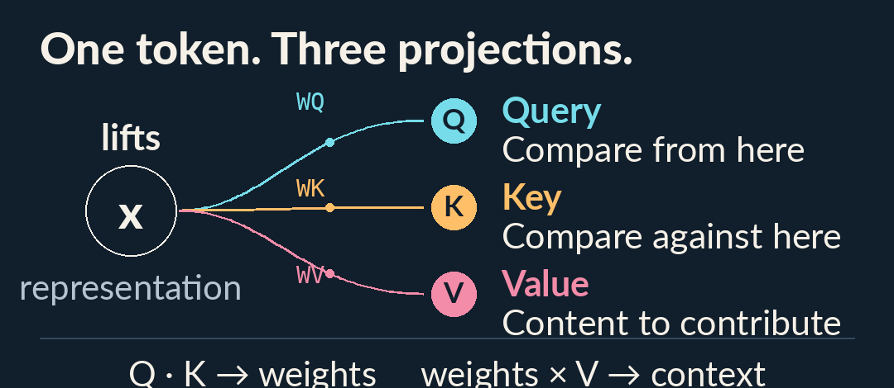
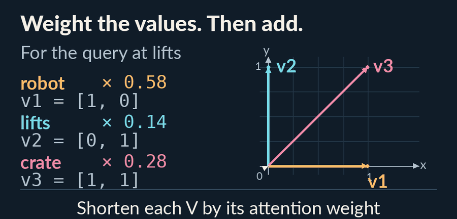
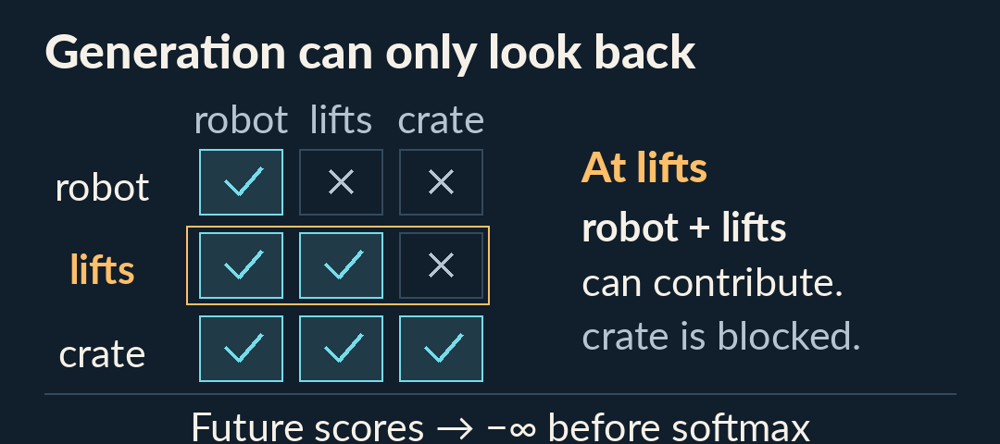
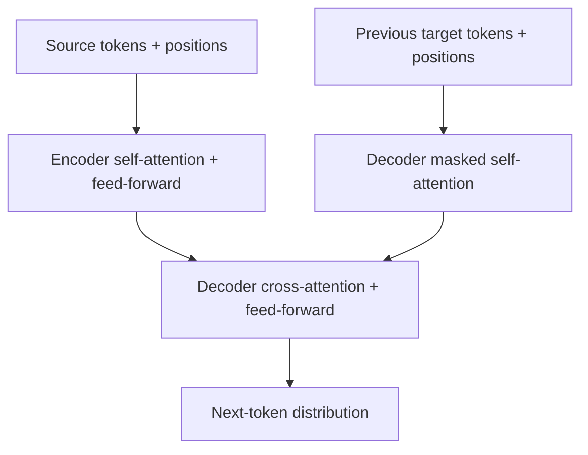

# Attention Is All You Need - Detailed Summary

📄 **Paper:** [Attention Is All You Need](https://arxiv.org/abs/1706.03762)<br>
👥 **Authors:** Ashish Vaswani, Noam Shazeer, Niki Parmar, Jakob Uszkoreit, Llion Jones, Aidan N. Gomez, Łukasz Kaiser, Illia Polosukhin<br>
🏛️ **Institutions:** Google Brain, Google Research; additional affiliations in paper<br>
📅 **First public version:** June 2017 · NeurIPS 2017

---

## 🎯 One-Line Summary

The Transformer performs sequence transduction with attention and position-wise feed-forward layers, without recurrent or convolutional sequence layers.

## 🔍 Problem Statement

Recurrence limits parallelization across positions during training. The paper asks whether attention can provide translation dependencies while reducing that sequential bottleneck.

## 💡 Key Innovation: The Transformer

### See attention work, one step at a time

A token's representation can borrow information from other positions. **Attention decides how much each position contributes, then blends their value vectors.**

<p></p>

**Query, key and value are learned projections of a token's current representation.** We show one query below; each position has its own query, key and value. Their roles are:

- **Query (Q):** the vector used to compare from the current position.
- **Key (K):** the vector used to compare against each input position.
- **Value (V):** the information that position contributes to the blend.

<details>
<summary><b>Watch values become context</b> · 5-second GIF</summary>

<p><picture>
<source media="(prefers-reduced-motion: reduce)" srcset="assets/attention-flow-still.png">

</picture></p>

The GIF plays once. Close this section to hide it, or [open the GIF file](assets/attention-flow.gif) to replay. Readers who prefer reduced motion see [the final still](assets/attention-flow-still.png).

Colors track the three input positions in this figure. Moving an arrow preserves its direction and length; placing the weighted arrows head-to-tail shows vector addition.

</details>

### Follow the same example without motion

**These are chosen toy vectors, not measurements from a trained model.** Imagine the three input positions `robot`, `lifts`, `crate`. For the query at `lifts`, let `q = [1, 0]`, with these keys and values:

| Position | Chosen projected vectors |
| :-- | :-- |
| `robot` | `k = [2, 0]`<br>`v = [1, 0]` |
| `lifts` | `k = [0, 2]`<br>`v = [0, 1]` |
| `crate` | `k = [1, 1]`<br>`v = [1, 1]` |

1. **Score each key:** compute `q · k / √dₖ`. With two key dimensions, the scores are approximately `1.41`, `0` and `0.71`.
2. **Normalize the scores:** softmax gives weights approximately `0.58`, `0.14` and `0.28`, summing to 1.
3. **Blend the values:** the output is `0.58 × [1, 0] + 0.14 × [0, 1] + 0.28 × [1, 1] ≈ [0.86, 0.42]`.

Numbers are rounded for display. This follows [§3.2's attention definition](https://arxiv.org/html/1706.03762v7#S3.SS2). The weights describe contributions from input positions; the result is a vector for further processing. The animation shows value scaling and addition; moving an arrow changes its placement, not the vector it represents. Implementations can compute query rows together.

### What changes when generating text?

The example above is **unmasked self-attention**, as used in the encoder. The decoder adds a causal mask so its representation cannot depend on future target input positions.

<p></p>

In the highlighted `lifts` row, the future `crate` position is blocked. Its score is set to `−∞` before softmax, giving it weight 0; the allowed positions' weights are renormalized. During training, the decoder's target inputs are shifted so predictions use the known prefix. See [§3.1 and §3.2.3](https://arxiv.org/html/1706.03762v7#S3.SS1).

<details>
<summary><b>Check your understanding</b></summary>

- **If one key's score rises while the other scores stay fixed, what changes?** Its value gets more weight; the other weights decrease.
- **Can a decoder query at `lifts` use the future `crate` input?** The causal mask blocks it. An encoder can use all supplied source positions.
- **Is the context vector already the next word?** It continues through the model's layers. The decoder eventually produces vocabulary probabilities through a separate output projection and softmax.

</details>

### Where this fits in the full Transformer

Multiple heads use different learned projections, combine their outputs and project them again. Attention works alongside feed-forward layers, residual connections, normalization and positional information:



| Component | Purpose |
| :-- | :-- |
| **Scaled dot-product attention** | `softmax(QKᵀ / √dₖ)V` combines values using query/key scores. |
| **Multiple heads** | Attend through different learned projections. |
| **Positional encoding** | Supply order information. |
| **Feed-forward layers** | Transform each position's representation. |
| **Residuals and normalization** | Support training stacked layers. |
| **Decoder masking** | Prevent access to future target tokens. |

## 📊 Results & Impact

[Version 7, §6.1 and Table 2](https://arxiv.org/pdf/1706.03762v7) reports **28.4 BLEU on WMT 2014 English–German** and **41.8 on English–French** for Transformer (big). The English–French model trained for **3.5 days on eight P100 GPUs**. These are historical translation results, not a universal workload speedup.

The architecture became a foundation for BERT and GPT. Later models change objectives and encoder/decoder arrangements; recurrent and state-space alternatives also exist.

## 💻 Implementation

Illustrative attention operation, assuming PyTorch and `math` are imported:

```python
def self_attention(query, key, value):
    scores = torch.matmul(query, key.transpose(-2, -1))
    weights = torch.softmax(scores / math.sqrt(query.size(-1)), dim=-1)
    return torch.matmul(weights, value)
```

The sketch omits masking, dropout, heads, projections, positions and surrounding layers. It is unsuitable as a complete causal decoder.

## ⚠️ Limitations & Challenges

- Dense full attention scales quadratically with sequence length.
- Autoregressive generation still emits tokens sequentially.
- Attention weights are not automatically faithful explanations of behavior.

## 🎓 Key Takeaways

Read the encoder, decoder and masking together. Parallel training and sequential generation are different properties.

## 📚 Essential Resources

- [Original paper and revisions](https://arxiv.org/abs/1706.03762)
- [Authors' Tensor2Tensor implementation](https://github.com/tensorflow/tensor2tensor)
- [The Illustrated Transformer](https://jalammar.github.io/illustrated-transformer/)
- [The Annotated Transformer](https://nlp.seas.harvard.edu/annotated-transformer/)
- [Architecture collection](../categories/architectures.md)

---

Part of [Awesome LLM Papers](../README.md). Summary reviewed 10 October 2026 against the linked source version. Visual pilot: original explanatory diagrams and a constructed one-head example.
