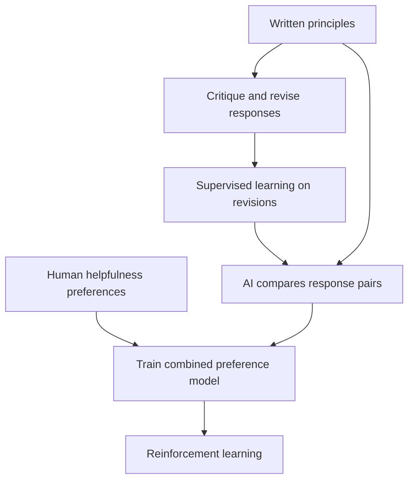

# Constitutional AI: Harmlessness from AI Feedback - Detailed Summary

📄 **Paper:** [Constitutional AI: Harmlessness from AI Feedback](https://arxiv.org/abs/2212.08073)<br>
👥 **Authors:** Yuntao Bai, Saurav Kadavath, Sandipan Kundu, Amanda Askell, et al. · Anthropic<br>
📅 **First public version:** December 2022

---

## 🎯 One-Line Summary

Written principles guide AI critiques, revisions and harmlessness preferences; human helpfulness feedback remains in the training process.

## 💡 Key Innovation: Constitutional AI (CAI)



| Stage | Use of principles |
| :-- | :-- |
| **Supervised learning** | Critique harmful responses and train on revisions. |
| **Reinforcement learning** | Combine AI harmlessness comparisons with human helpfulness comparisons. |

Humans still choose principles, shape models and evaluate behavior.

## 📊 Results & Impact

[Version 1, §4 and Figures 2 and 8](https://arxiv.org/pdf/2212.08073v1) evaluate the helpfulness/harmlessness trade-off through crowdworker preferences. RL-CAI improves that trade-off in the reported settings; no universal “2–3× fewer harmful responses” follows.

The evaluation policy favors thoughtful, less evasive responses when alternatives are equally harmless. That instruction is part of the score's meaning.

## 💻 Implementation

Illustrative workflow, not a complete training implementation:

```text
Generate → critique under a principle → revise → collect for SFT
Separately compare responses → train preference model → optimize with RL
```

A revision is not guaranteed safe simply because a model critiqued it.

## ⚠️ Limitations & Challenges

- AI feedback can inherit model biases and judge errors.
- Principles can conflict or admit different interpretations.
- Preference scores do not prove resistance to every jailbreak.
- The method reduces a particular annotation burden; human helpfulness labels and evaluation remain.

## 🎓 Key Takeaways

Read the constitution, feedback source and evaluation policy together. Explicit principles are inspectable; trained behavior still needs testing.

## 📚 Essential Resources

- [Original paper and revisions](https://arxiv.org/abs/2212.08073)
- [Methods and evaluations — version 1](https://arxiv.org/pdf/2212.08073v1)
- [Anthropic's publication page](https://www.anthropic.com/research/constitutional-ai-harmlessness-from-ai-feedback)
- [InstructGPT summary](RLHF%20Training%20with%20Human%20Feedback.md)
- [Safety collection](../categories/safety.md)

---

Part of [Awesome LLM Papers](../README.md). Summary reviewed 10 October 2026 against the linked source version.
