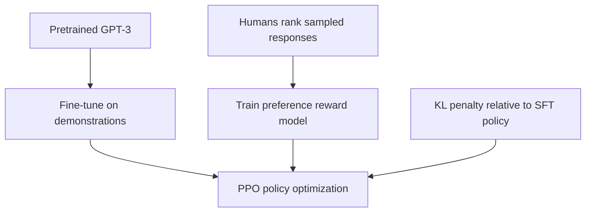

# RLHF: Training Language Models with Human Feedback - Detailed Summary

📄 **Paper:** [Training language models to follow instructions with human feedback](https://arxiv.org/abs/2203.02155)<br>
👥 **Authors:** Long Ouyang, Jeffrey Wu, Xu Jiang, Diogo Almeida, Carroll L. Wainwright, et al. · OpenAI<br>
📅 **First public version:** March 2022 · NeurIPS 2022

---

## 🎯 One-Line Summary

InstructGPT adapts pretrained GPT-3 to instructions through human demonstrations, preference modeling and reinforcement learning.

## 💡 Key Innovation: Three-Stage RLHF Pipeline



| Stage | Signal | Purpose |
| :-- | :-- | :-- |
| **SFT** | Human-written responses | Initialize instruction-following behavior. |
| **Reward modeling** | Comparisons of sampled outputs | Predict labeler preferences. |
| **PPO** | Reward with KL regularization | Optimize the proxy while constraining drift. |

PPO-ptx also mixes in a pretraining objective to reduce public-task regressions.

[Version 1, Appendix Table 6](https://arxiv.org/html/2203.02155v1) lists **12,725 SFT**, **33,207 reward-model**, and **31,144 PPO training prompts**. Prompts are not counts of pairwise comparisons.

## 📊 Results & Impact

On the authors' prompt distribution, labelers preferred 1.3B InstructGPT to 175B GPT-3. [§4](https://arxiv.org/html/2203.02155v1#S4) also evaluates truthfulness, toxicity and public tasks. This does not imply a smaller model has greater capability on every task.

## 💻 Implementation

Conceptual objective:

```text
policy objective ≈ preference reward − β × KL(policy || SFT policy)
PPO-ptx additionally mixes in a pretraining objective.
```

Working training needs rollout sampling, a value estimator, token likelihoods and PPO's clipped objective. This is a pipeline explanation, not executable training code.

## ⚠️ Limitations & Challenges

- Selected labelers' preferences need not represent every user's values.
- KL regularization does not guarantee safety or prevent reward exploitation.
- Harmful/false outputs and distribution-shift failures remain possible.
- Pretraining, demonstrations and preference annotation are separate costs.

## 🔮 What Came After

[DPO](https://arxiv.org/abs/2305.18290) derives a direct preference objective without fitting a separate reward model. [Reward overoptimization](https://arxiv.org/abs/2210.10760) studies an imperfect proxy against a synthetic gold reward.

## 🎓 Key Takeaways

Distinguish what labelers prefer, what a reward model predicts and what a deployed user needs.

## 📚 Essential Resources

- [Original paper and revisions](https://arxiv.org/abs/2203.02155)
- [Methods and evaluations — version 1](https://arxiv.org/html/2203.02155v1)
- [Authors' evaluation samples](https://github.com/openai/following-instructions-human-feedback) — not a full training implementation
- [Training collection](../categories/training.md)

---

Part of [Awesome LLM Papers](../README.md). Summary reviewed 10 October 2026 against the linked source version.
