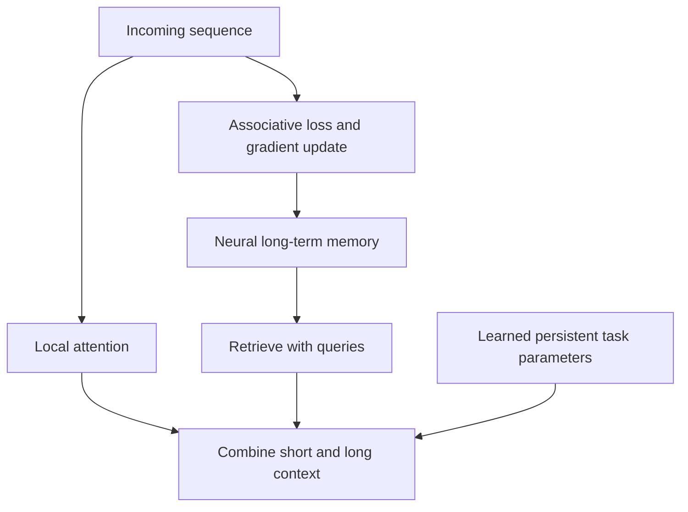

# Titans: Learning to Memorize at Test Time - Detailed Summary

📄 **Paper:** [Titans](https://arxiv.org/abs/2501.00663) 
👥 **Authors:** Ali Behrouz, Peilin Zhong, Vahab Mirrokni · Google Research 
📅 **First public version:** 31 December 2024 · identifier assigned January 2025

---

## 🎯 One-Line Summary

Titans combines local attention with neural memory whose parameters adapt to an incoming sequence at test time.

## 🔍 Problem Statement

Full attention can retrieve individual details but becomes expensive for long inputs. Recurrent states compress history into limited capacity. Titans studies a separate memory network that learns how to update as information arrives.

## 💡 Key Innovation: Neural Long-Term Memory

The memory learns projected key/value associations through gradient updates on an associative loss. Momentum carries recent surprise forward; learned decay controls forgetting. Queries retrieve information through the memory network.

*Conceptual map; exact wiring depends on the variant.*

| Variant | Integration |
| :-- | :-- |
| **MAC — Memory as Context** | Retrieved memory joins the segment's attention context. |
| **MAG — Memory as Gate** | A gated branch combines attention and memory. |
| **MAL — Memory as Layer** | Memory is composed as a processing layer. |

**Persistent memory** is learned, input-independent task parameters; it differs from the sequence-dependent neural memory updated online.

## 📊 Results & Impact

[Version 1, §5 and Tables 1–3](https://arxiv.org/html/2501.00663v1#S5) covers language modeling, commonsense tasks, long-context recall, time series and DNA modeling. Long-context demonstrations exceed two million tokens. Results depend on task, size and variant; MAL is not a universal winner.

Read each result with its training context, baseline context window and memory size. A long input window does not establish reliable recall of every fact.

## 💻 Implementation

Start with [§3's update equations and §4's architectures](https://arxiv.org/html/2501.00663v1#S3). An attention-over-slots toy would omit the central gradient update, momentum and decay, so it would misrepresent Titans.

## ⚠️ Limitations & Open Questions

- Compressed history can lose information; updates and forgetting need evaluation under distribution changes.
- The experiments do not establish perfect recall across conversations or a ready-made layer replacement for existing models.
- Earlier fast-weight and recurrent-memory work matters; neural memory itself predates Titans.

## 🎓 Key Takeaways

Ask how memory is updated, separate the three memory roles, and compare variants under a matched task and budget.

## 📚 Essential Resources

- [Original paper and revision history](https://arxiv.org/abs/2501.00663)
- [Memory Transformer](https://arxiv.org/abs/2006.11527) — a different memory architecture
- [Advancing Transformer Architecture in Long-Context Large Language Models: A Comprehensive Survey](https://arxiv.org/abs/2311.12351)
- [Memory-system collection](../categories/rag.md#-memory-systems)

---

Part of [Awesome LLM Papers](../README.md). Summary reviewed 10 October 2026 against the linked source version.
